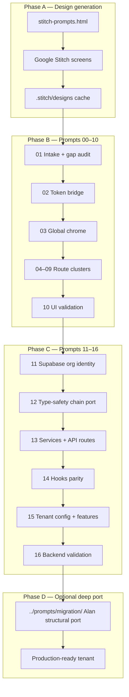

# Master playbook — Stitch wireframes → full Movemental tenant

End-to-end orchestration for migrating any Movemental thought-leader deployment. **Detailed copy-paste prompts:** [AGENT_RUNBOOK.md](./AGENT_RUNBOOK.md).

**Execute in:** `{{TARGET_REPO}}` (e.g. `movement-leader-websites/danielle-strickland`).  
**Parameter source:** [TENANT_MANIFEST.md](./TENANT_MANIFEST.template.md) (fork and fill).

---

## Pipeline overview

---

## Phase A — Generate Stitch wireframes (human + Stitch)

**Not automated.** Use the shared prompt library at `{{STITCH_PROMPTS_HTML}}`.

- Project name: `{{STITCH_PROJECT_NAME}}` (typically `movemental-base-wireframe`)
- Order: Foundation (0) → Chrome (1) → Pages (2–35)

Stitch screens use **Brad Brisco placeholder copy** by design. Section **order** applies to every tenant; copy is replaced in Phase B via `tenant.config.ts` and research docs.

---

## Phase B — Frontend migration (Prompts 00–10)

| Step | AGENT_RUNBOOK section | Outcome |
|------|----------------------|---------|
| 0 | Prompt 00 | Scope, branch, manifest read |
| 1 | Prompt 01 | Cache + screen↔route map + gap audit |
| 2 | Prompt 02 | Wireframe grayscale → `{{DESIGN_THEME}}` tokens |
| 3 | Prompt 03 | Header, footer, `(public)/layout` |
| 4 | Prompt 04 | `/`, `/about`, `/contact`, `/pricing` |
| 5 | Prompt 05 | `/pathways/*` |
| 6 | Prompt 06 | `/content/*` |
| 7 | Prompt 07 | `/courses/*` |
| 8 | Prompt 08 | AI, chat, auth, account |
| 9 | Prompt 09 | Search, checkout, optional, legal |
| 10 | Prompt 10 | UI gate + checklist update |

**Conversion primitive:** `stitch-react` skill at `{{STITCH_REACT_SKILL}}`  
**Orchestration:** `stitch-page-port` skill in target repo `.claude/skills/`

**Incomplete template rule:** If Stitch HTML lacks a checklist section, **synthesize** from `{{REFERENCE_REPO}}` structure + tenant tokens + manifest copy. Never leave IA gaps.

---

## Phase C — Backend migration (Prompts 11–16)

Types flow **downstream only:** `Drizzle schema → Zod → Services → API routes → Hooks → UI`

| Step | AGENT_RUNBOOK section | Outcome |
|------|----------------------|---------|
| 11 | Prompt 11 | Org row, content counts, MCP audit |
| 12 | Prompt 12 | Generators, `validate:all` |
| 13 | Prompt 13 | Services + `app/api/**` |
| 14 | Prompt 14 | Hooks + wire UI sections |
| 15 | Prompt 15 | `tenant.config.ts` ↔ DB |
| 16 | Prompt 16 | Full gate, docs, handoff |

**Skill:** `tenant-backend-parity` · **Audit:** `tenant-migrate` in Prompt 11 and 15

---

## Phase D — Structural port (optional)

When Stitch + backend prompts are insufficient for course player internals or route normalization:

- [../prompts/migration/README.md](../prompts/migration/README.md) — Alan Hirsch code-level port
- Especially: course infra (02), page structure (05), content substitution (06)

Run **after** Prompt 16 when hook/API gaps remain flagged in Prompt 10 report.

---

## Single-session agent checklist

Before coding:

1. Read `TENANT_MANIFEST.md` — confirm `{{TENANT_SLUG}}`, `{{TENANT_ORG_ID}}`
2. Read [AGENT_RUNBOOK.md](./AGENT_RUNBOOK.md) for the prompt(s) in scope
3. Branch name (`slice/Sxx-stitch-*` or `slice/Sxx-backend-*`)
4. Routes / layers touched
5. Blockers (missing Stitch screens, MCP auth, zero DB content for enabled feature)

---

## Deliverable definition — migration complete

| Layer | Criterion |
|-------|-----------|
| **IA** | All in-scope routes match checklist + STITCH_ROUTE_INDEX |
| **UI** | No `PlaceholderPage`, no `dangerouslySetInnerHTML`, semantic tokens only |
| **Types** | `pnpm validate:all` green |
| **Tenant** | `pnpm verify:tenant-org` green; no source-tenant leaks |
| **Features** | `features.*` matches org content counts |
| **Docs** | `REFERENCE_PAGE_COMPARISON.md` + checklist updated |

---

## File index

| Artifact | Purpose |
|----------|---------|
| [AGENT_RUNBOOK.md](./AGENT_RUNBOOK.md) | Full step-by-step agent prompts |
| [TENANT_MANIFEST.template.md](./TENANT_MANIFEST.template.md) | Per-leader parameters |
| [COMPONENT_CHECKLIST.template.md](./COMPONENT_CHECKLIST.template.md) | Fork for route status matrix |
| [PROMPT_TEMPLATE.md](./PROMPT_TEMPLATE.md) | Ad-hoc per-route prompt |
| [STITCH_ROUTE_INDEX.md](./STITCH_ROUTE_INDEX.md) | Stitch order ↔ route lookup |

---

*Tenant-agnostic. Fork manifest + checklist for each leader in `movement-leader-websites/`.*
