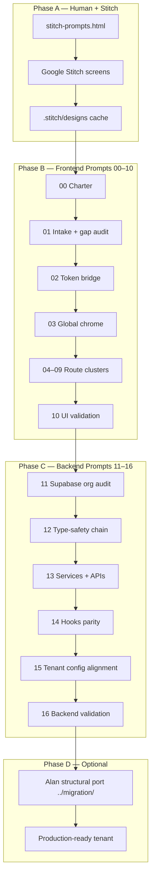

# Stitch migration — page-by-page tenant onboarding

**Audience:** Coding agents (Cursor, Claude Code) and engineers migrating any Movemental thought-leader site under `movement-leader-websites/`.

**Purpose:** Move a tenant from **Google Stitch B&W wireframes** → **production Next.js React (L4/L5)** → **Supabase-backed data** → **tenant-correct copy and config** — one route cluster at a time, with validation gates between slices.

This is **not** a Tailwind-only conversion guide. It covers intake, token bridging, global chrome, per-route IA, incomplete-template synthesis, hook wiring, backend parity, and merge gates.

---

## Start here

| Doc | When to use |
|-----|-------------|
| **[AGENT_RUNBOOK.md](./AGENT_RUNBOOK.md)** | **Primary handoff** — full step-by-step prompts for agents (Prompts 00–16) |
| [MASTER_PLAYBOOK.md](./MASTER_PLAYBOOK.md) | Pipeline overview and phase diagram |
| [TENANT_MANIFEST.template.md](./TENANT_MANIFEST.template.md) | Fork → `TENANT_MANIFEST.md` before any work |
| [STITCH_ROUTE_INDEX.md](./STITCH_ROUTE_INDEX.md) | Stitch order ↔ Next.js route lookup |
| [COMPONENT_CHECKLIST.template.md](./COMPONENT_CHECKLIST.template.md) | Fork → `COMPONENT_CHECKLIST.md` living status matrix |
| [PROMPT_TEMPLATE.md](./PROMPT_TEMPLATE.md) | Ad-hoc single-route prompt when 04–09 don't fit |

---

## Architecture

---

## Claude skills map

Use skills instead of re-implementing orchestration logic.

| Phase | Skill | Location |
|-------|-------|----------|
| **Hub / orchestrator** | `tenant-migration-playbook` | `.claude/skills/tenant-migration-playbook/SKILL.md` |
| **01 Intake** | `stitch-intake-audit` | `.claude/skills/stitch-intake-audit/SKILL.md` |
| **02 Tokens** | `stitch-token-bridge` | `.claude/skills/stitch-token-bridge/SKILL.md` |
| **03–09 Pages** | `stitch-page-port` | `.claude/skills/stitch-page-port/SKILL.md` |
| **10 UI gate** | `stitch-migration-validate` | `.claude/skills/stitch-migration-validate/SKILL.md` |
| **11–16 Backend** | `tenant-backend-parity` | `.claude/skills/tenant-backend-parity/SKILL.md` |
| **HTML → React primitive** | **`stitch-react`** | `../../../brad-brisco/.claude/skills/stitch-react/SKILL.md` |
| **Supabase audit** | `tenant-migrate` | `../../../brad-brisco/.claude/skills/tenant-migrate/SKILL.md` |
| **Deep course/route code port** | `tenant-structural-port` | `.claude/skills/tenant-structural-port/SKILL.md` |

**Critical:** `stitch-page-port` orchestrates tenant correctness; **`stitch-react`** does the mechanical HTML/Tailwind → React/Next.js/Tailwind decomposition. Always delegate conversion to `stitch-react`, then apply token bridge, manifest copy, hooks, and feature gates from `stitch-page-port`.

---

## Shared upstream assets (all tenants)

| Asset | Path |
|-------|------|
| Stitch prompt library (36 routes + foundation) | `../../../brad-brisco/docs/build/stitch-prompts.html` |
| Reference architecture (code) | `../../../alan-hirsch` |
| L4 / L5 design docs | `../../../brad-brisco/docs/internal/design/` |
| Leaders manifest | `../../../../movement-leader-websites/leaders.manifest.json` |

---

## New tenant quick-start

1. Scaffold repo: `movement-leader-websites/{slug}/` (from `_template-full` or reference tenant).
2. Copy [TENANT_MANIFEST.template.md](./TENANT_MANIFEST.template.md) → `TENANT_MANIFEST.md` — fill org ID, design theme, pathways, leak patterns.
3. Copy [COMPONENT_CHECKLIST.template.md](./COMPONENT_CHECKLIST.template.md) → `COMPONENT_CHECKLIST.md`.
4. Open [AGENT_RUNBOOK.md](./AGENT_RUNBOOK.md) and run **Prompt 00** → **Prompt 16** in order (or slice by cluster).
5. Branch naming: `slice/Sxx-stitch-{topic}` or `slice/Sxx-backend-{topic}` — never commit to `main`.

---

## Branch and slice conventions

| Slice | Prompts | Typical PR scope |
|-------|---------|------------------|
| S-stitch-chrome | 02–03, 10 | layout + navigation |
| S-stitch-home | 04, 10 | `/`, `/about`, `/contact`, `/pricing` |
| S-stitch-pathways | 05, 10 | `/pathways/*` |
| S-stitch-content | 06, 10 | `/content/*` |
| S-stitch-courses | 07, 10 | `/courses/*` (+ optional `../migration/02–03`) |
| S-stitch-ai-auth | 08, 10 | AI, chat, auth, account |
| S-stitch-utility | 09, 10 | search, checkout, legal |
| S-backend-full | 11–16 | type chain + hooks + config |

One slice per PR. Run Prompt 10 after every UI slice.

---

## Definition of done (full migration)

| Layer | Criterion |
|-------|-----------|
| **IA** | All in-scope routes match `STITCH_ROUTE_INDEX` + `COMPONENT_CHECKLIST` section order |
| **UI** | No `PlaceholderPage`, no `dangerouslySetInnerHTML`, semantic tokens only |
| **Types** | `pnpm validate:all` green |
| **Tenant** | `pnpm verify:tenant-org` green; no source-tenant leaks in `src/` |
| **Features** | `features.*` matches org content counts in Supabase |
| **Docs** | `REFERENCE_PAGE_COMPARISON.md` + checklist updated |

---

## Related docs in this repo

| Path | Role |
|------|------|
| `docs/build/COMPONENT_CHECKLIST.md` | Danielle Strickland living checklist |
| `docs/build/notes/stitch-token-bridge.md` | Token mapping (from Prompt 02) |
| `docs/build/notes/stitch-screen-route-map.md` | Screen ↔ route map (from Prompt 01) |
| `docs/build/prompts/migration/` | Alan Hirsch **structural** port (Phase D — course infra, route normalization) |
| `.stitch/designs/` | Cached Stitch HTML + PNG per route |

---

*Tenant-agnostic system. Fork manifest + checklist per leader. Last updated: 2026-07-04.*
