Create diagrams and visualizations using Mermaid: $ARGUMENTS

$ARGUMENTS should include:
- What to diagram (flowchart, sequence, class, state, ER, architecture, timeline, mindmap, etc.)
- Optionally: the system or concept to visualize
- Optionally: target format (markdown code block, React component, SVG export, Excalidraw conversion)
- Optionally: theme preference (default, dark, forest, neutral)
- Optionally: target file path
- Empty — ask the user what they want to diagram

## Authoritative Documentation

### Primary References
- Introduction: https://mermaid.js.org/intro/
- Getting Started: https://mermaid.js.org/intro/getting-started.html
- Configuration: https://mermaid.js.org/config/setup/README.html
- Theming: https://mermaid.js.org/config/theming.html
- Directives: https://mermaid.js.org/config/directives.html
- Accessibility: https://mermaid.js.org/config/accessibility.html

### Diagram Syntax References
- Flowchart: https://mermaid.js.org/syntax/flowchart.html
- Sequence Diagram: https://mermaid.js.org/syntax/sequenceDiagram.html
- Class Diagram: https://mermaid.js.org/syntax/classDiagram.html
- State Diagram: https://mermaid.js.org/syntax/stateDiagram.html
- Entity Relationship: https://mermaid.js.org/syntax/entityRelationshipDiagram.html
- Gantt Chart: https://mermaid.js.org/syntax/gantt.html
- Pie Chart: https://mermaid.js.org/syntax/pie.html
- Quadrant Chart: https://mermaid.js.org/syntax/quadrantChart.html
- Git Graph: https://mermaid.js.org/syntax/gitgraph.html
- Mindmap: https://mermaid.js.org/syntax/mindmap.html
- Timeline: https://mermaid.js.org/syntax/timeline.html
- Sankey: https://mermaid.js.org/syntax/sankey.html
- XY Chart: https://mermaid.js.org/syntax/xyChart.html
- Block Diagram: https://mermaid.js.org/syntax/block.html
- Packet Diagram: https://mermaid.js.org/syntax/packet.html
- Kanban: https://mermaid.js.org/syntax/kanban.html
- Architecture: https://mermaid.js.org/syntax/architecture.html
- User Journey: https://mermaid.js.org/syntax/userJourney.html
- Requirement Diagram: https://mermaid.js.org/syntax/requirementDiagram.html
- C4 Diagram: https://mermaid.js.org/syntax/c4.html
- Zenuml: https://mermaid.js.org/syntax/zenuml.html

### Ecosystem
- Live Editor: https://mermaid.live/
- Mermaid CLI (mmdc): https://github.com/mermaid-js/mermaid-cli
- Mermaid-to-Excalidraw: https://www.npmjs.com/package/@excalidraw/mermaid-to-excalidraw
- GitHub: https://github.com/mermaid-js/mermaid
- npm: https://www.npmjs.com/package/mermaid

### Integration
- Usage in Markdown (GitHub, GitLab): https://mermaid.js.org/ecosystem/integrations-community.html
- API Usage: https://mermaid.js.org/config/usage.html
- Security: https://mermaid.js.org/config/usage.html#security

## Before Starting

1. Determine the output format: markdown code block (most common), React component, or SVG export
2. For React integration: `pnpm add mermaid` (client-side rendering only)
3. For CLI export: `npx -y @mermaid-js/mermaid-cli mmdc -i input.mmd -o output.svg`
4. For Excalidraw conversion: `pnpm add @excalidraw/mermaid-to-excalidraw`
5. Mermaid renders in GitHub/GitLab markdown natively — no setup needed for docs

## Diagram Type Selection Guide

| Need | Diagram Type | Keyword |
|---|---|---|
| Process flow, decision trees | Flowchart | `flowchart TD` |
| API call sequences, interactions | Sequence Diagram | `sequenceDiagram` |
| Object models, inheritance | Class Diagram | `classDiagram` |
| Lifecycle, transitions | State Diagram | `stateDiagram-v2` |
| Database schema | Entity Relationship | `erDiagram` |
| Project timelines | Gantt Chart | `gantt` |
| Proportions | Pie Chart | `pie` |
| 2x2 analysis | Quadrant Chart | `quadrantChart` |
| Branch/merge history | Git Graph | `gitGraph` |
| Brainstorming, hierarchy | Mindmap | `mindmap` |
| Chronological events | Timeline | `timeline` |
| Flow quantities | Sankey | `sankey-beta` |
| Data visualization | XY Chart | `xychart-beta` |
| System architecture | Architecture | `architecture-beta` |
| User experience mapping | User Journey | `journey` |
| Board/task status | Kanban | `kanban` |
| Network packets | Packet Diagram | `packet-beta` |

## Flowchart — The Most Versatile

### Directions
- `TD` or `TB` — top to bottom
- `BT` — bottom to top
- `LR` — left to right
- `RL` — right to left

### Node Shapes

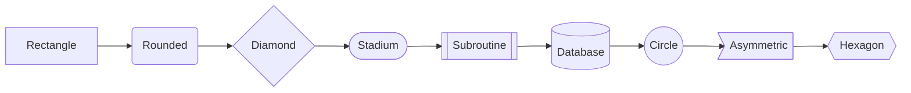

### Edge Types

```mermaid
flowchart LR
    A --> B           %% Arrow
    A --- B           %% Line (no arrow)
    A -.-> B          %% Dotted arrow
    A ==> B           %% Thick arrow
    A --text--> B     %% Arrow with label
    A ---|label| B    %% Line with label
    A <--> B          %% Bidirectional
```

### Subgraphs

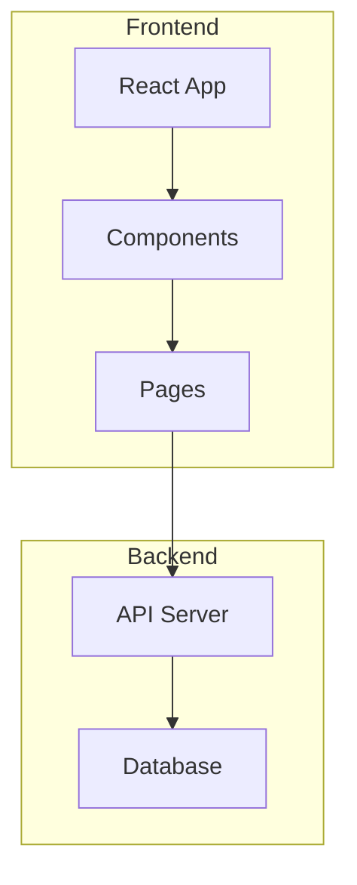

### Styling

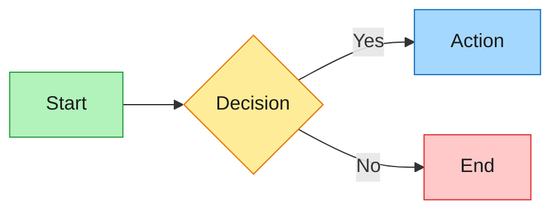

## Sequence Diagram

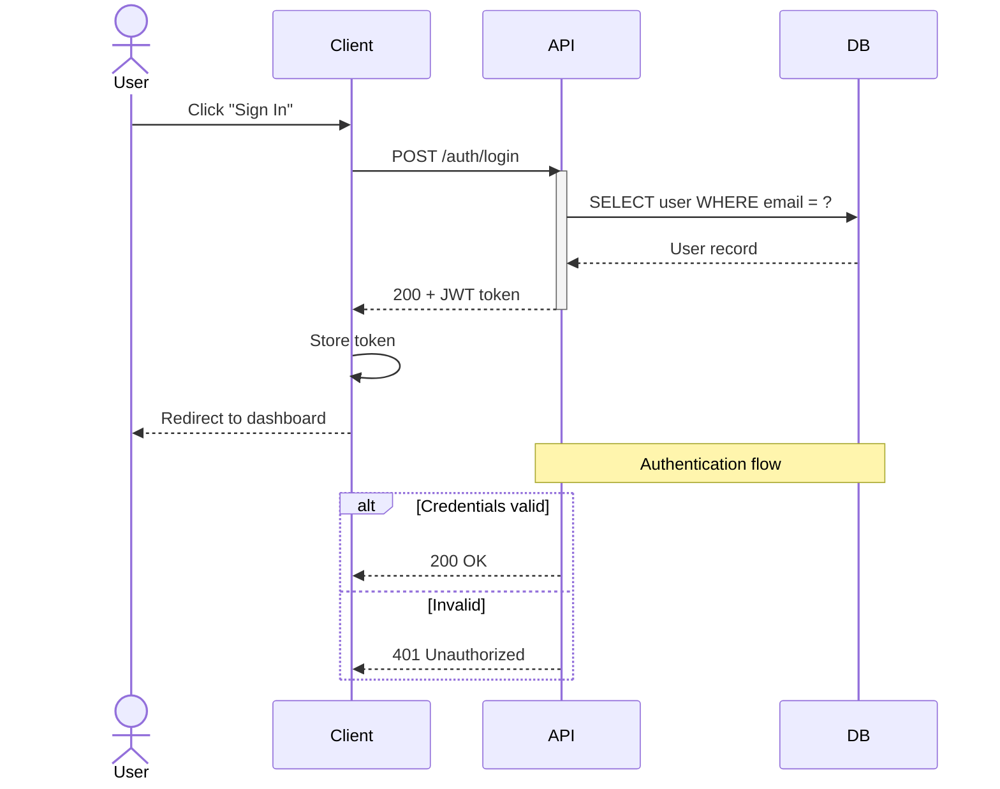

### Key Syntax
- `->>` solid arrow (request)
- `-->>` dashed arrow (response)
- `activate`/`deactivate` — activation boxes
- `Note over A,B: text` — spanning notes
- `alt`/`else`/`end` — conditional blocks
- `loop`/`end` — loop blocks
- `par`/`and`/`end` — parallel execution
- `critical`/`option`/`end` — critical regions
- `break`/`end` — break flow
- `rect rgb(...)` — background highlighting

## Class Diagram

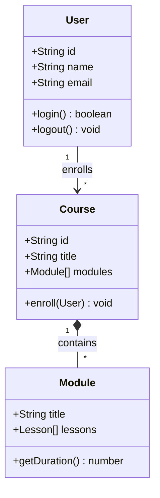

### Relationships
- `A <|-- B` — inheritance (B extends A)
- `A *-- B` — composition (A owns B)
- `A o-- B` — aggregation (A has B)
- `A --> B` — association
- `A ..> B` — dependency
- `A ..|> B` — realization/implements

### Cardinality
- `"1"` — exactly one
- `"0..1"` — zero or one
- `"*"` — many
- `"1..*"` — one or more

## State Diagram

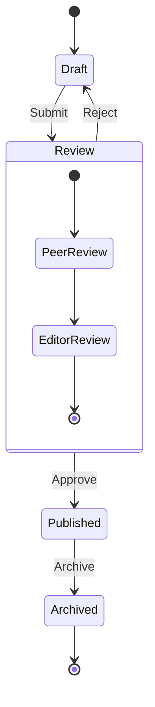

## Entity Relationship Diagram

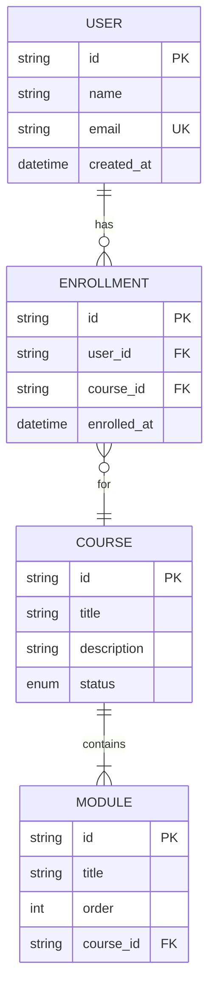

### Relationship Notation
- `||--||` — exactly one to exactly one
- `||--o{` — one to zero or more
- `||--|{` — one to one or more
- `}o--o{` — zero or more to zero or more

## Gantt Chart

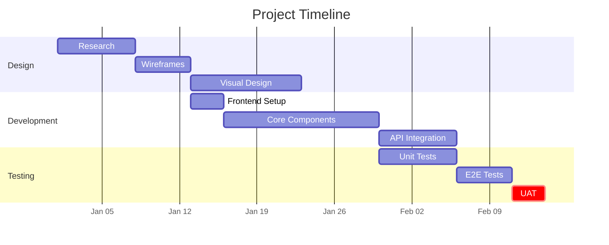

## Mindmap

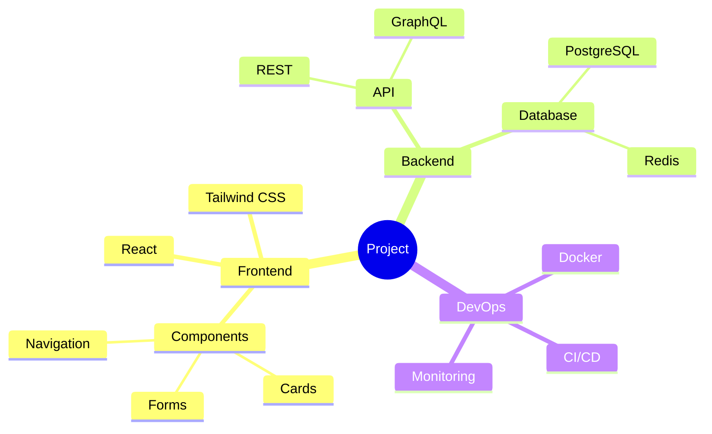

## Timeline

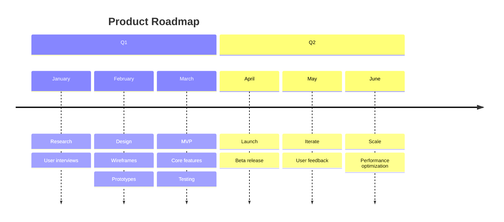

## Pie Chart

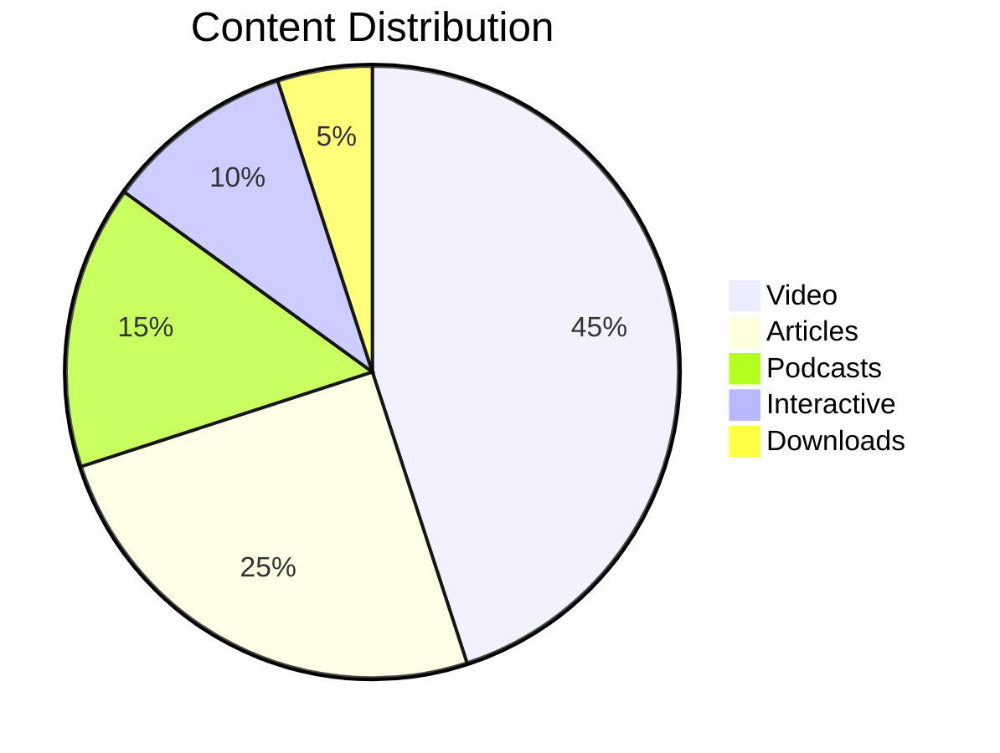

## Architecture Diagram

```mermaid
architecture-beta
    group api(cloud)[API Layer]
    group data(database)[Data Layer]

    service client(internet)[Client App] in api
    service gateway(server)[API Gateway] in api
    service auth(lock)[Auth Service] in api
    service db(database)[PostgreSQL] in data
    service cache(database)[Redis] in data

    client:R --> L:gateway
    gateway:R --> L:auth
    gateway:B --> T:db
    auth:B --> T:cache
```

## User Journey

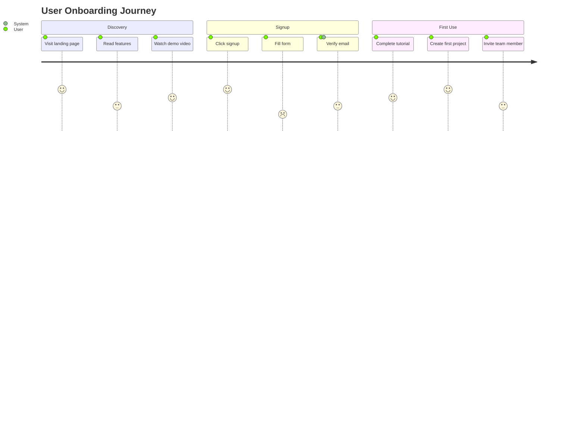

## Theming

### Built-in Themes

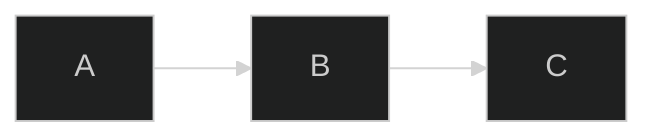

Available themes: `default`, `dark`, `forest`, `neutral`, `base`

### Custom Theme Variables

```mermaid
%%{init: {
  'theme': 'base',
  'themeVariables': {
    'primaryColor': '#a5d8ff',
    'primaryTextColor': '#1a1a1a',
    'primaryBorderColor': '#1971c2',
    'lineColor': '#868e96',
    'secondaryColor': '#b2f2bb',
    'tertiaryColor': '#ffec99',
    'fontFamily': 'Inter, sans-serif',
    'fontSize': '14px'
  }
}}%%
```

### Key Theme Variables
| Variable | Affects |
|---|---|
| `primaryColor` | Main node fill |
| `primaryTextColor` | Text on primary nodes |
| `primaryBorderColor` | Primary node borders |
| `secondaryColor` | Secondary node fill |
| `tertiaryColor` | Tertiary node fill |
| `lineColor` | Edge/arrow color |
| `fontFamily` | All text |
| `fontSize` | Base font size |
| `noteTextColor` | Note text |
| `noteBkgColor` | Note background |

## React Integration

### Client-Side Rendering

```tsx
"use client";

import { useEffect, useRef } from "react";
import mermaid from "mermaid";

interface MermaidProps {
  chart: string;
  theme?: "default" | "dark" | "forest" | "neutral";
}

export function Mermaid({ chart, theme = "default" }: MermaidProps) {
  const ref = useRef<HTMLDivElement>(null);

  useEffect(() => {
    mermaid.initialize({
      startOnLoad: false,
      theme,
      securityLevel: "loose",
      fontFamily: "Inter, sans-serif",
    });

    const render = async () => {
      if (ref.current) {
        const id = `mermaid-${Math.random().toString(36).slice(2)}`;
        const { svg } = await mermaid.render(id, chart);
        ref.current.innerHTML = svg;
      }
    };

    render();
  }, [chart, theme]);

  return <div ref={ref} className="overflow-x-auto" />;
}
```

### Next.js Dynamic Import (required)

```tsx
import dynamic from "next/dynamic";

const Mermaid = dynamic(
  () => import("@/components/Mermaid").then((m) => m.Mermaid),
  { ssr: false }
);

export default function Page() {
  return (
    <Mermaid
      chart={`
        flowchart LR
          A[Start] --> B[End]
      `}
      theme="dark"
    />
  );
}
```

### CLI Export (SVG/PNG/PDF)

```bash
# Install CLI
npm install -g @mermaid-js/mermaid-cli

# Render to SVG
mmdc -i diagram.mmd -o diagram.svg

# Render to PNG
mmdc -i diagram.mmd -o diagram.png -b transparent

# With custom theme
mmdc -i diagram.mmd -o diagram.svg -t dark

# With custom CSS
mmdc -i diagram.mmd -o diagram.svg -C styles.css
```

### Excalidraw Conversion

```typescript
import { parseMermaidToExcalidraw } from "@excalidraw/mermaid-to-excalidraw";

const { elements, files } = await parseMermaidToExcalidraw(`
  flowchart TD
    A[Start] --> B{Decision}
    B -->|Yes| C[Action]
    B -->|No| D[End]
`);

// Use elements in Excalidraw component
```

## Syntax Pitfalls

| Issue | Wrong | Right |
|---|---|---|
| Special chars in labels | `A[Label (info)]` | `A["Label (info)"]` |
| HTML in labels | `A[<b>Bold</b>]` | `A["**Bold**"]` |
| Escaping quotes | `A["He said "hi""]` | `A["He said 'hi'"]` |
| Long labels | Very long inline text | Use `\n` for line breaks |
| Subgraph naming | `subgraph My Group` | `subgraph myGroup["My Group"]` |
| Comments | `// comment` | `%% comment` |

## Security Configuration

```javascript
mermaid.initialize({
  securityLevel: "strict",    // Default — sanitizes HTML
  // "loose" — allows HTML in labels (use only in trusted contexts)
  // "antiscript" — allows HTML but removes scripts
  // "sandbox" — renders in sandboxed iframe
});
```

## Output Format

```
## Mermaid Diagram

### Type: [Flowchart / Sequence / Class / etc.]
### Purpose: [What this diagram shows]

### Diagram
[The mermaid code block]

### Rendering
- Format: markdown code block / React component / SVG export
- Theme: dark
- Target: [file path or "inline markdown"]

### Next Steps
- Review diagram accuracy
- Adjust styling/theme if needed
- Convert to Excalidraw for editability (optional)
```

## Rules

- Use `flowchart` (not `graph`) — `graph` is legacy syntax
- Use `stateDiagram-v2` — v1 is deprecated
- Quote labels containing special characters: parentheses, brackets, pipes
- Use `%%` for comments — not `//` or `#`
- Keep node IDs short and alphanumeric — use labels for display text
- For React: always client-render (no SSR), use dynamic import in Next.js
- Set `securityLevel: "strict"` in production, `"loose"` only in trusted dev contexts
- Use `classDef` for consistent node styling — don't inline styles on individual nodes
- Prefer `LR` (left-to-right) for process flows, `TD` (top-down) for hierarchies
- For large diagrams, use subgraphs to organize and improve readability
- Test diagrams at https://mermaid.live/ before committing
- When converting to Excalidraw, use `@excalidraw/mermaid-to-excalidraw`
